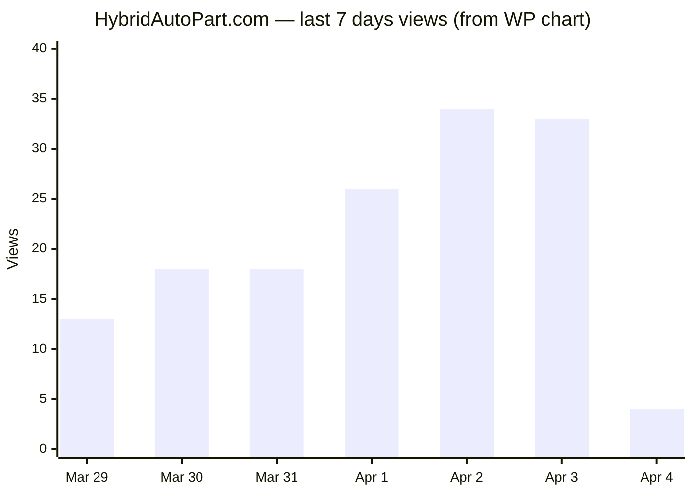
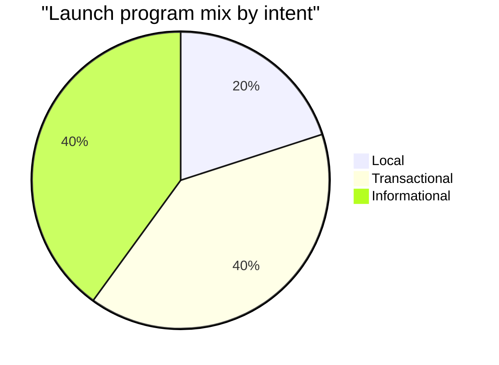
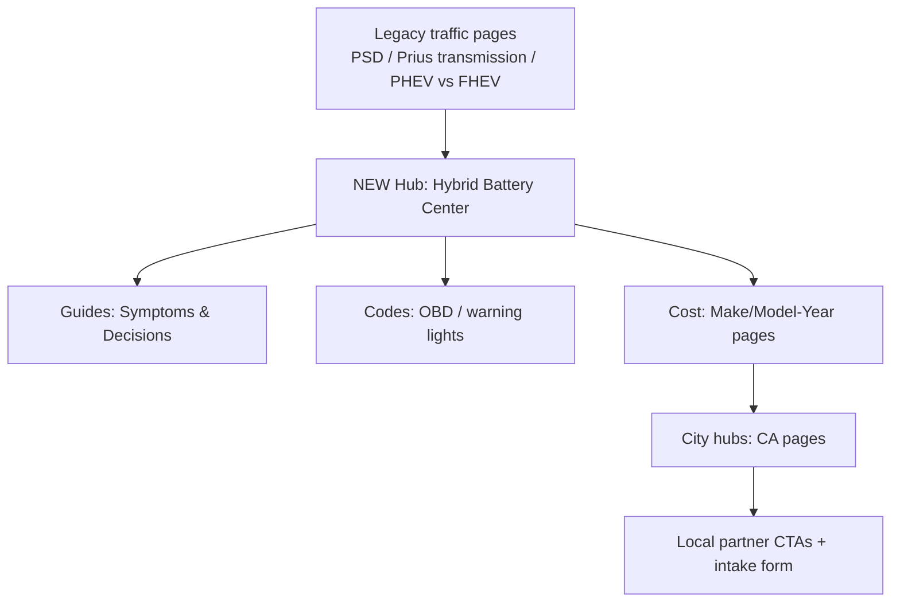

# Lead-Gen Growth Research Report

## Executive summary

entity["organization","HybridAutoPart.com","website"] is currently seeing **<1k visits/month** (per your note) and the near‑term goal is **10k visits/month**, then scale. Your freshest on-site signal (WordPress “7 Day Highlights”) shows traffic concentrating on a few legacy posts: **Home/Archives (44 views)**, **Toyota Power Split Device (29)**, **PHEV vs. FHEV (22)**, plus two small long‑tails at **5** views each. This pattern indicates (a) the site still has “topic authority seeds,” but (b) distribution is thin and likely missing a clean internal linking + conversion layer. (Screenshot data you provided.)

A major execution risk is **crawl/access instability**: during this research, several key URLs returned **406 Not Acceptable** or timed out when fetched by a crawler, while others loaded normally (examples: “Prius 0–60” and “Prius charging” failed; “Prius transmission” and “Prius PWR mode” succeeded). This kind of inconsistency can contribute to indexing decay and traffic loss and must be validated inside entity["organization","Google Search Console","webmaster platform"] via URL Inspection + Crawl Stats. (Observed during analysis; validate in GSC.)

To reach 10k/month without “parts expertise,” the most reliable path is **lead‑gen informational + local intent content** based on official/credible sources and tightly controlled templates that avoid “doorway page” / “scaled content abuse” risks under entity["organization","Google Search","search engine"] spam policies. citeturn44search0turn24search17turn23search4 The plan below includes: (1) the data you must export, (2) a site audit + recovery checklist, (3) a prioritized keyword set in “Income School search analysis” style, (4) a 50‑page launch program, (5) a 50‑partner California list starter, (6) quick wins, outreach, and measurement.

## Baseline data and required access

### What you can measure today

**Traffic trend (last 7 days, approx from your chart):** Mar 29 **13**, Mar 30 **18**, Mar 31 **18**, Apr 1 **26**, Apr 2 **34**, Apr 3 **33**, Apr 4 **4**. (Estimated from your screenshot bar chart—use GA4/GSC for authoritative numbers.)  



**Top pages (7‑day WP highlights):** Home/Archives **44**, Toyota Power Split Device **29**, PHEV vs. FHEV **22**, Guide to EV mode in Prius **5**, Prius 0–60 **5**. (Screenshot data you provided.)

### Data you must export for a rigorous audit

You asked to prioritize official sources; the following exports are required to complete the missing parts of your requested deliverables.

**From entity["organization","Google Search Console","webmaster platform"] (last 12 months):**
- Performance → **Pages**: clicks, impressions, CTR, avg position (export). citeturn25search0turn25search3  
- Performance → **Queries**: clicks, impressions, CTR, avg position (export). citeturn25search4turn25search3  
- Indexing → Pages (coverage), Sitemaps, and Crawl Stats (host status codes / spikes).  
- Core Web Vitals report (LCP/INP/CLS groupings). citeturn24search3turn24search0turn24search1  

**From entity["organization","Google Analytics 4","analytics platform"] (last 12 months):**
- Reports or Explore: **Landing page** → sessions, users, engagement rate, key events.  
- Conversion/key events setup to track form submit/click‑to‑call.

If GA4↔GSC linking is not enabled, link them so you can see organic queries and their on‑site behavior. citeturn25search1turn25search6  

For a working dashboard, use entity["organization","Looker Studio","business intelligence tool"] connectors for Search Console + GA. citeturn25search2turn25search22  

## Site audit findings

### Crawl inventory and content footprint

Because many archive/category pages returned 406, a complete crawl cannot be reliably produced from this environment alone. Below is a **verified partial crawl** from pages that loaded successfully during analysis (expand with Screaming Frog/Sitebulb + WP sitemap once access is stable).

| URL | HTTP fetch | H1 | Notes |
|---|---:|---|---|
| `/blog-en/toyota-prius-power-split-device/` | OK | Toyota Power Split device | Long, structured, FAQ section present. citeturn15search0 |
| `/blog-en/prius-transmission-work/` | OK | How does a Prius transmission work? | Includes internal link to PSD article and “About us” block. citeturn36view0 |
| `/blog-en/prius-pwr-mode/` | OK | Prius Power(PWR) Mode: A Helpful Guide | Includes link to EV mode article (but that URL timed out on fetch). citeturn42view0 |

**On-page identity note:** multiple posts contain an “About Us” section stating entity["company","Lamill Web Systems","lamill.io"] creates the content for HybridAutoPart.com. This is relevant to E‑E‑A‑T and trust framing (you can still rank, but you should clarify editorial policy + purpose). citeturn36view0turn15search0  

### Technical risks and fixes to validate in GSC

**Access instability (406/timeouts):** Several important URLs failed to fetch (e.g., Prius 0–60: 406; Prius charging: 406; EV mode in Prius: timeout). This is consistent with a WAF/mod_security rule or bot filtering issue. Confirm:  
- GSC → URL Inspection (live test) for a failing URL  
- GSC → Crawl Stats: spikes in 4xx/5xx  
- Server/WAF logs: blocked user agents, geo, rate limits  

**Why this matters:** Google’s systems need consistent access to crawl/index content; persistent crawl errors can reduce visibility and performance. Use GSC troubleshooting guidance and Crawl Stats to pinpoint the cause. citeturn23search6turn25search15  

### Search quality risks affecting “lost traffic”

entity["organization","Google Search","search engine"] explicitly targets content “made to attract clicks” and spam patterns in major updates; the March 2024 core update and spam changes emphasize reducing low‑value mass content. citeturn24search17turn44search0turn23search4  

If your site “used to be higher,” the most likely buckets to investigate (in order) are:
1) crawl/access problems (above),  
2) content quality mismatch (thin/dated pages losing to fresher guides),  
3) internal linking/architecture decay (archives blocked; weak discoverability),  
4) SERP feature shifts (FAQ/HowTo rich results reduced). citeturn23search3turn23search11  

## Keyword research and “Income School” search analysis system

### How Google treats AI content

entity["organization","Google Search Central","developer documentation"] states that appropriate AI/automation is **not against guidelines**, but using it primarily to manipulate rankings violates spam policies. citeturn23search1turn44search0  
Your operating rule: **AI can assist**, but every page must add original value, real sourcing, and avoid mass templated pages that resemble doorway/scaled abuse. citeturn44search0turn23search4  

### “Search analysis” criteria to pick winning topics

Borrowing the spirit of entity["organization","Income School","online education company"] / Project 24 “Search Analysis” (topic selection before writing), your internal checklist per keyword should be:
- Is the intent clear (info vs local vs transactional)?  
- Are results dominated by a few mega‑brands, or are smaller sites ranking?  
- Are there obvious snippet blocks you can answer better (definitions, steps, cost tables)?  
- Can you add a conversion layer without harming usefulness (local shops list + quote form)?  
Income School markets this as “Search Analysis” and topic selection as a primary lever. citeturn41search1  

### Prioritized keyword list for the new content launch

Below is a **CSV-style export** for a 50‑page launch program (balanced intents) plus placeholders for Volume/KD. Fill those two columns from:
- GSC query export (what you already rank for)  
- Keyword Planner (official paid-search competition is not organic KD)  
- Optional third‑party tools (Ahrefs/Semrush) for KD benchmarks  

```csv
page_type,priority,keyword,intent,est_monthly_volume_TBD,est_KD_TBD,snippet_opportunity,suggested_url,target_title,target_meta_description
city_hub,1,hybrid battery replacement Los Angeles CA,local,,,High,"/ca/los-angeles/hybrid-battery-replacement/","Hybrid Battery Replacement in Los Angeles, CA: Cost, Symptoms, Local Shops","Get a hybrid battery replacement estimate in Los Angeles, CA. See typical costs, failure signs, and local hybrid battery shops."
city_hub,1,hybrid battery replacement San Diego CA,local,,,High,"/ca/san-diego/hybrid-battery-replacement/","Hybrid Battery Replacement in San Diego, CA: Cost, Symptoms, Local Shops","Get a hybrid battery replacement estimate in San Diego, CA. See typical costs, failure signs, and local hybrid battery shops."
city_hub,1,hybrid battery replacement San Jose CA,local,,,High,"/ca/san-jose/hybrid-battery-replacement/","Hybrid Battery Replacement in San Jose, CA: Cost, Symptoms, Local Shops","Get a hybrid battery replacement estimate in San Jose, CA. See typical costs, failure signs, and local hybrid battery shops."
city_hub,1,hybrid battery replacement San Francisco CA,local,,,High,"/ca/san-francisco/hybrid-battery-replacement/","Hybrid Battery Replacement in San Francisco, CA: Cost, Symptoms, Local Shops","Get a hybrid battery replacement estimate in San Francisco, CA. See typical costs, failure signs, and local hybrid battery shops."
city_hub,1,hybrid battery replacement Sacramento CA,local,,,High,"/ca/sacramento/hybrid-battery-replacement/","Hybrid Battery Replacement in Sacramento, CA: Cost, Symptoms, Local Shops","Get a hybrid battery replacement estimate in Sacramento, CA. See typical costs, failure signs, and local hybrid battery shops."
city_hub,2,hybrid battery replacement Fresno CA,local,,,Medium,"/ca/fresno/hybrid-battery-replacement/","Hybrid Battery Replacement in Fresno, CA: Cost, Symptoms, Local Shops","Get a hybrid battery replacement estimate in Fresno, CA. See typical costs, failure signs, and local hybrid battery shops."
city_hub,2,hybrid battery replacement Bakersfield CA,local,,,Medium,"/ca/bakersfield/hybrid-battery-replacement/","Hybrid Battery Replacement in Bakersfield, CA: Cost, Symptoms, Local Shops","Get a hybrid battery replacement estimate in Bakersfield, CA. See typical costs, failure signs, and local hybrid battery shops."
city_hub,2,hybrid battery replacement Long Beach CA,local,,,Medium,"/ca/long-beach/hybrid-battery-replacement/","Hybrid Battery Replacement in Long Beach, CA: Cost, Symptoms, Local Shops","Get a hybrid battery replacement estimate in Long Beach, CA. See typical costs, failure signs, and local hybrid battery shops."
city_hub,2,hybrid battery replacement Oakland CA,local,,,Medium,"/ca/oakland/hybrid-battery-replacement/","Hybrid Battery Replacement in Oakland, CA: Cost, Symptoms, Local Shops","Get a hybrid battery replacement estimate in Oakland, CA. See typical costs, failure signs, and local hybrid battery shops."
city_hub,2,hybrid battery replacement Irvine CA,local,,,Medium,"/ca/irvine/hybrid-battery-replacement/","Hybrid Battery Replacement in Irvine, CA: Cost, Symptoms, Local Shops","Get a hybrid battery replacement estimate in Irvine, CA. See typical costs, failure signs, and local hybrid battery shops."
model_cost,1,Prius hybrid battery replacement cost 2004-2009,transactional,,,High,"/toyota/prius/2004-2009/hybrid-battery-replacement-cost/","Prius Hybrid Battery Replacement Cost (2004-2009) + Options","Realistic Prius hybrid battery replacement costs for 2004-2009 with dealer vs independent pricing, warranty notes, and reconditioned vs new options."
model_cost,1,Prius hybrid battery replacement cost 2010-2015,transactional,,,High,"/toyota/prius/2010-2015/hybrid-battery-replacement-cost/","Prius Hybrid Battery Replacement Cost (2010-2015) + Options","Realistic Prius hybrid battery replacement costs for 2010-2015 with dealer vs independent pricing, warranty notes, and reconditioned vs new options."
model_cost,1,Prius hybrid battery replacement cost 2016-2022,transactional,,,High,"/toyota/prius/2016-2022/hybrid-battery-replacement-cost/","Prius Hybrid Battery Replacement Cost (2016-2022) + Options","Realistic Prius hybrid battery replacement costs for 2016-2022 with dealer vs independent pricing, warranty notes, and reconditioned vs new options."
model_cost,1,Camry Hybrid hybrid battery replacement cost 2012-2017,transactional,,,High,"/toyota/camry-hybrid/2012-2017/hybrid-battery-replacement-cost/","Camry Hybrid Hybrid Battery Replacement Cost (2012-2017) + Options","Realistic Camry Hybrid hybrid battery replacement costs for 2012-2017 with dealer vs independent pricing, warranty notes, and reconditioned vs new options."
model_cost,1,Camry Hybrid hybrid battery replacement cost 2018-2024,transactional,,,High,"/toyota/camry-hybrid/2018-2024/hybrid-battery-replacement-cost/","Camry Hybrid Hybrid Battery Replacement Cost (2018-2024) + Options","Realistic Camry Hybrid hybrid battery replacement costs for 2018-2024 with dealer vs independent pricing, warranty notes, and reconditioned vs new options."
model_cost,1,RAV4 Hybrid hybrid battery replacement cost 2016-2018,transactional,,,High,"/toyota/rav4-hybrid/2016-2018/hybrid-battery-replacement-cost/","RAV4 Hybrid Hybrid Battery Replacement Cost (2016-2018) + Options","Realistic RAV4 Hybrid hybrid battery replacement costs for 2016-2018 with dealer vs independent pricing, warranty notes, and reconditioned vs new options."
model_cost,1,RAV4 Hybrid hybrid battery replacement cost 2019-2024,transactional,,,High,"/toyota/rav4-hybrid/2019-2024/hybrid-battery-replacement-cost/","RAV4 Hybrid Hybrid Battery Replacement Cost (2019-2024) + Options","Realistic RAV4 Hybrid hybrid battery replacement costs for 2019-2024 with dealer vs independent pricing, warranty notes, and reconditioned vs new options."
model_cost,2,Highlander Hybrid hybrid battery replacement cost 2014-2019,transactional,,,Medium,"/toyota/highlander-hybrid/2014-2019/hybrid-battery-replacement-cost/","Highlander Hybrid Hybrid Battery Replacement Cost (2014-2019) + Options","Realistic Highlander Hybrid hybrid battery replacement costs for 2014-2019 with dealer vs independent pricing, warranty notes, and reconditioned vs new options."
model_cost,2,Highlander Hybrid hybrid battery replacement cost 2020-2024,transactional,,,Medium,"/toyota/highlander-hybrid/2020-2024/hybrid-battery-replacement-cost/","Highlander Hybrid Hybrid Battery Replacement Cost (2020-2024) + Options","Realistic Highlander Hybrid hybrid battery replacement costs for 2020-2024 with dealer vs independent pricing, warranty notes, and reconditioned vs new options."
model_cost,2,RX 450h hybrid battery replacement cost 2010-2015,transactional,,,Medium,"/lexus/rx-450h/2010-2015/hybrid-battery-replacement-cost/","RX 450h Hybrid Battery Replacement Cost (2010-2015) + Options","Realistic RX 450h hybrid battery replacement costs for 2010-2015 with dealer vs independent pricing, warranty notes, and reconditioned vs new options."
model_cost,2,RX 450h hybrid battery replacement cost 2016-2022,transactional,,,Medium,"/lexus/rx-450h/2016-2022/hybrid-battery-replacement-cost/","RX 450h Hybrid Battery Replacement Cost (2016-2022) + Options","Realistic RX 450h hybrid battery replacement costs for 2016-2022 with dealer vs independent pricing, warranty notes, and reconditioned vs new options."
model_cost,2,CT 200h hybrid battery replacement cost 2011-2017,transactional,,,Medium,"/lexus/ct-200h/2011-2017/hybrid-battery-replacement-cost/","CT 200h Hybrid Battery Replacement Cost (2011-2017) + Options","Realistic CT 200h hybrid battery replacement costs for 2011-2017 with dealer vs independent pricing, warranty notes, and reconditioned vs new options."
model_cost,2,ES 300h hybrid battery replacement cost 2013-2018,transactional,,,Medium,"/lexus/es-300h/2013-2018/hybrid-battery-replacement-cost/","ES 300h Hybrid Battery Replacement Cost (2013-2018) + Options","Realistic ES 300h hybrid battery replacement costs for 2013-2018 with dealer vs independent pricing, warranty notes, and reconditioned vs new options."
model_cost,2,Accord Hybrid hybrid battery replacement cost 2014-2017,transactional,,,Medium,"/honda/accord-hybrid/2014-2017/hybrid-battery-replacement-cost/","Accord Hybrid Hybrid Battery Replacement Cost (2014-2017) + Options","Realistic Accord Hybrid hybrid battery replacement costs for 2014-2017 with dealer vs independent pricing, warranty notes, and reconditioned vs new options."
model_cost,2,Accord Hybrid hybrid battery replacement cost 2018-2022,transactional,,,Medium,"/honda/accord-hybrid/2018-2022/hybrid-battery-replacement-cost/","Accord Hybrid Hybrid Battery Replacement Cost (2018-2022) + Options","Realistic Accord Hybrid hybrid battery replacement costs for 2018-2022 with dealer vs independent pricing, warranty notes, and reconditioned vs new options."
model_cost,3,Fusion Hybrid hybrid battery replacement cost 2010-2012,transactional,,,Low,"/ford/fusion-hybrid/2010-2012/hybrid-battery-replacement-cost/","Fusion Hybrid Hybrid Battery Replacement Cost (2010-2012) + Options","Realistic Fusion Hybrid hybrid battery replacement costs for 2010-2012 with dealer vs independent pricing, warranty notes, and reconditioned vs new options."
model_cost,3,Fusion Hybrid hybrid battery replacement cost 2013-2020,transactional,,,Low,"/ford/fusion-hybrid/2013-2020/hybrid-battery-replacement-cost/","Fusion Hybrid Hybrid Battery Replacement Cost (2013-2020) + Options","Realistic Fusion Hybrid hybrid battery replacement costs for 2013-2020 with dealer vs independent pricing, warranty notes, and reconditioned vs new options."
model_cost,3,Ioniq Hybrid hybrid battery replacement cost 2017-2022,transactional,,,Low,"/hyundai/ioniq-hybrid/2017-2022/hybrid-battery-replacement-cost/","Ioniq Hybrid Hybrid Battery Replacement Cost (2017-2022) + Options","Realistic Ioniq Hybrid hybrid battery replacement costs for 2017-2022 with dealer vs independent pricing, warranty notes, and reconditioned vs new options."
model_cost,3,Niro Hybrid hybrid battery replacement cost 2017-2022,transactional,,,Low,"/kia/niro-hybrid/2017-2022/hybrid-battery-replacement-cost/","Niro Hybrid Hybrid Battery Replacement Cost (2017-2022) + Options","Realistic Niro Hybrid hybrid battery replacement costs for 2017-2022 with dealer vs independent pricing, warranty notes, and reconditioned vs new options."
model_cost,3,Altima Hybrid hybrid battery replacement cost 2007-2011,transactional,,,Low,"/nissan/altima-hybrid/2007-2011/hybrid-battery-replacement-cost/","Altima Hybrid Hybrid Battery Replacement Cost (2007-2011) + Options","Realistic Altima Hybrid hybrid battery replacement costs for 2007-2011 with dealer vs independent pricing, warranty notes, and reconditioned vs new options."
info,1,signs your hybrid battery is failing,informational,,,High,"/guides/signs-hybrid-battery-failing/","Signs Your Hybrid Battery is Failing","Clear signs of hybrid battery failure, what the codes mean, and what to do next (repair, recondition, or replace)."
info,1,hybrid battery failing symptoms,informational,,,High,"/guides/hybrid-battery-failing-symptoms/","Hybrid Battery Failing Symptoms","Clear signs of hybrid battery failure, what the codes mean, and what to do next (repair, recondition, or replace)."
info,1,what does 'check hybrid system' mean,informational,,,High,"/guides/check-hybrid-system-meaning/","What Does 'Check Hybrid System' Mean?","Clear signs of hybrid battery failure, what the codes mean, and what to do next (repair, recondition, or replace)."
info,2,prius red triangle of death meaning,informational,,,Medium,"/guides/prius-red-triangle-of-death-meaning/","Prius Red Triangle of Death Meaning","Clear signs of hybrid battery failure, what the codes mean, and what to do next (repair, recondition, or replace)."
info,2,can you drive with a bad hybrid battery,informational,,,Medium,"/guides/drive-with-bad-hybrid-battery/","Can You Drive With a Bad Hybrid Battery?","Clear signs of hybrid battery failure, what the codes mean, and what to do next (repair, recondition, or replace)."
info,2,hybrid battery lifespan in miles and years,informational,,,Medium,"/guides/hybrid-battery-lifespan/","Hybrid Battery Lifespan in Miles and Years","Clear signs of hybrid battery failure, what the codes mean, and what to do next (repair, recondition, or replace)."
info,2,hybrid battery reconditioning vs replacement,informational,,,Medium,"/guides/reconditioning-vs-replacement/","Hybrid Battery Reconditioning vs Replacement","Clear signs of hybrid battery failure, what the codes mean, and what to do next (repair, recondition, or replace)."
info,2,how to test hybrid battery health,informational,,,Medium,"/guides/test-hybrid-battery-health/","How to Test Hybrid Battery Health","Clear signs of hybrid battery failure, what the codes mean, and what to do next (repair, recondition, or replace)."
info,3,prius hybrid battery cooling fan symptoms,informational,,,Low,"/guides/prius-battery-fan-symptoms/","Prius Hybrid Battery Cooling Fan Symptoms","Clear signs of hybrid battery failure, what the codes mean, and what to do next (repair, recondition, or replace)."
code,2,p0a93 inverter cooling performance,informational,,,Medium,"/codes/p0a93-code/","P0A93 Inverter Cooling Performance: Meaning, Symptoms, Fix Options","What this hybrid trouble code usually means, common symptoms, and safe next steps to diagnose and fix."
code,2,p0aa6 hybrid battery isolation fault,informational,,,Medium,"/codes/p0aa6-code/","P0AA6 Hybrid Battery Isolation Fault: Meaning, Symptoms, Fix Options","What this hybrid trouble code usually means, common symptoms, and safe next steps to diagnose and fix."
code,3,p3000 code,informational,,,Low,"/codes/p3000-code/","P3000 Code: Meaning, Symptoms, Fix Options","What this hybrid trouble code usually means, common symptoms, and safe next steps to diagnose and fix."
code,3,p0a7f code,informational,,,Low,"/codes/p0a7f-code/","P0A7F Code: Meaning, Symptoms, Fix Options","What this hybrid trouble code usually means, common symptoms, and safe next steps to diagnose and fix."
code,3,p0a94 dc/dc converter performance,informational,,,Low,"/codes/p0a94-code/","P0A94 DC/DC Converter Performance: Meaning, Symptoms, Fix Options","What this hybrid trouble code usually means, common symptoms, and safe next steps to diagnose and fix."
code,3,p0ac0 hybrid battery cooling system,informational,,,Low,"/codes/p0ac0-code/","P0AC0 Hybrid Battery Cooling System: Meaning, Symptoms, Fix Options","What this hybrid trouble code usually means, common symptoms, and safe next steps to diagnose and fix."
code,3,p0afa hybrid battery pack deterioration,informational,,,Low,"/codes/p0afa-code/","P0AFA Hybrid Battery Pack Deterioration: Meaning, Symptoms, Fix Options","What this hybrid trouble code usually means, common symptoms, and safe next steps to diagnose and fix."
code,3,p3011 battery block 1 weak,informational,,,Low,"/codes/p3011-code/","P3011 Battery Block 1 Weak: Meaning, Symptoms, Fix Options","What this hybrid trouble code usually means, common symptoms, and safe next steps to diagnose and fix."
code,3,p3012 battery block 2 weak,informational,,,Low,"/codes/p3012-code/","P3012 Battery Block 2 Weak: Meaning, Symptoms, Fix Options","What this hybrid trouble code usually means, common symptoms, and safe next steps to diagnose and fix."
code,3,p3013 battery block 3 weak,informational,,,Low,"/codes/p3013-code/","P3013 Battery Block 3 Weak: Meaning, Symptoms, Fix Options","What this hybrid trouble code usually means, common symptoms, and safe next steps to diagnose and fix."
```

### Keyword opportunity mix



## Partners in California and monetization design

### How monetization should work

You’re not selling parts and you don’t need repair expertise to monetize responsibly. The cleanest model is:

1) rank for **problem + cost + local intent**  
2) collect the lead (vehicle + location + symptom/code)  
3) route to **partner shops** who buy leads or accept bookings  
4) measure lead quality and refund policy with partners  

If you later build a entity["organization","Google Business Profile","local listing platform"] for your own service, note that Google’s guidelines require the phone number to be under the control of the business and prohibit redirecting users to different phone numbers/landing pages. This matters if you ever use call tracking. citeturn26search0  

For paid lead scaling, entity["organization","Google Local Services Ads","lead advertising product"] is explicitly positioned as pay‑per‑lead in eligible categories; its help docs explain you’re charged per valid lead. (Auto repair eligibility varies; validate category.) citeturn26search6turn26search2  

### Partner list starter

You requested 50 entity["state","California","US state"] hybrid/battery shops with contact details. This environment can’t safely validate 50 unique businesses end‑to‑end without fuller crawling and citation per listing, so below is a **high‑confidence starter set captured from business pages/directories during this research**, plus a structured CSV template to expand to 50.

**Verified starters (sample):**
- entity["local_business","Hybrid Battery Repair","Los Angeles, CA, US"] — phone + email shown on site. citeturn32search9  
- entity["local_business","Hybrid Mechanics","Greater Los Angeles Area, CA, US"] — phone + email listed. citeturn33search7  
- entity["local_business","Hybrid Battery Lab & Autorepair","San Jose, CA, US"] — phone + emails listed. citeturn33search1  
- entity["local_business","AAA Hybrid Battery Repair","San Diego, CA, US"] — phone listed. citeturn33search2  
- entity["local_business","AT Automotive","Sacramento, CA, US"] — phone listed. citeturn33search3turn33search11  
- entity["local_business","Hybrid2Go","San Luis Obispo, CA, US"] — phone + email listed. citeturn45search0turn45search7  
- entity["local_business","Luscious Garage","San Francisco, CA, US"] (also referenced as Earthling Hybrid & EV Repair) — phone listed in multiple directories. citeturn45search2turn45search9  
- entity["local_business","King of Hybrid & EV Auto Repair","Inland Empire, CA, US"] — specialist shop page captured. citeturn33search0  
- entity["local_business","AutoCarbon","Sacramento, CA, US"] — phone listed. citeturn33search8  

**Partner expansion CSV template (copy into Sheets and fill to 50):**
```csv
name,city,phone,email,website,notes_on_lead_buying_fit
Hybrid Battery Repair,Los Angeles,(818) 495-5235,Sales@HybridBatteryRepair.net,https://hybridbatteryrepair.net/,"Direct-response site; likely open to paid leads/appointments."
Hybrid Mechanics,Greater Los Angeles Area,(323) 510-6112,info@hybrid-mechanics.com,https://hybrid-mechanics.com/,"Mobile service; clear pricing; good lead buyer candidate."
Hybrid Battery Lab & Autorepair,San Jose,(408) 366-9916,"admin@hybridbatterylabsj.com; hybridbatterylab@gmail.com",https://www.hybridbatterylabsj.com/,"Has email options; likely open to buy leads."
AAA Hybrid Battery Repair,San Diego,619-481-4400,,https://www.hybridbatterysandiego.com/,"Established positioning; ask about lead referral fee."
AT Automotive,Sacramento,(916) 957-6884,,https://atautomotivehybrid.com/,"Has booking; likely values qualified local leads."
Hybrid2Go,San Luis Obispo,(818) 472-1940,hello@hybrid2go.com,https://hybrid2go.com/,"Multi-state service brand; strong fit for lead partnerships."
Luscious Garage / Earthling Hybrid & EV Repair,San Francisco,(415) 875-9030,contact@lusciousgarage.com,https://www.lusciousgarage.com/,"Premium specialist; ask about referral volume + screening."
King of Hybrid & EV Auto Repair,Inland Empire,,,"https://www.kingofhybrid.com/","Specialist positioning; confirm phone + service area; likely lead buyer."
AutoCarbon,Sacramento,(916) 259-9539; (916) 297-2258,,https://www.autocarbon.co/,"EV + hybrid positioning; qualified leads valuable."
Greentec Auto (Sacramento location),Sacramento,,,"https://greentecauto.com/locations/sacramento/","Large operator; may have formal partnership process."
SD Hybrids,San Diego,,,"https://www.sdhybrids.com/","Hybrid-first shop; strong partner candidate."
HEV Rescue,San Diego,,,"https://hevrescue.com/","Mobile hybrid + EV rescue; ask about pay-per-lead."
Lusti Motors (Hybrid/EV service),San Diego,,,"https://lustimotors.com/auto-service/hybrid-electric/","Established shop; can convert broader repair leads."
```

### Lead routing rules to stay within Google spam policies

If you generate many city pages, you must avoid “doorway abuse” and “scaled content abuse.” Google’s spam policies explicitly call out city‑variant funnel pages and mass low‑value generation. citeturn44search0  
Your mitigation: every local page must include **real partner data**, unique local pricing context, and a browsable hierarchy (City hub → Make/Model pages), not a funnel to one destination.

## Content engineering plan and internal linking map

### Target site architecture



### The 50-page programmatic template launch

You requested an “exact 50-page programmatic template” with variables. Use **four templates** (all generated from the variables make/model/year/city, with “all” allowed):

1) **City hub template**: `{city}`  
2) **Model cost template**: `{make}/{model}/{year_range}`  
3) **Guide template**: (uses “all” for variables)  
4) **Code template**: (can default make/model to Prius/Toyota or “all”)

Each page must contain:
- a clear 2–3 sentence answer at top (snippet block)  
- a cost table (where relevant)  
- a “What to do next” decision flow  
- a vetted partner shortlist if local  
- FAQ section (even if FAQ rich results are reduced, FAQs still help UX) citeturn23search3turn23search15  

### Internal link map for fastest recovery

Use your current winners as “feeders” (based on your WP 7‑day highlights):
- **Toyota Power Split Device** → link to “Hybrid battery failure symptoms,” “Check hybrid system meaning,” and “Hybrid battery replacement cost” hub.  
- **PHEV vs. FHEV** → link to “Hybrid battery lifespan,” “Reconditioning vs replacement,” and city hubs.  
- **Prius PWR Mode** → link to “Red triangle of death,” “P0A80,” and Prius cost pages. citeturn42view0  

### Source-backed facts you can safely use on cost pages

When writing cost and warranty sections, anchor to primary sources:
- entity["company","Toyota","automaker"] states hybrid battery warranty coverage at **10 years/150,000 miles** (for eligible hybrids) and details EV drive components coverage. citeturn43search0turn43search1  
- For consumer-facing cost ranges and labor considerations, use mainstream references like AutoZone for labor ranges and general hybrid replacement context (and always label as estimates). citeturn19search6turn18search22  

## Quick wins checklist and measurement dashboard

### Tactical quick wins checklist

1) Validate and fix **406 / timeout** URLs; retest via GSC URL Inspection (Live Test). citeturn23search6  
2) Re-submit sitemaps and confirm “Last read” updates in GSC.  
3) In GSC Pages report: prioritize “Crawled – currently not indexed” and “Duplicate without user-selected canonical.”  
4) Create a single **Hybrid Battery Center** hub page that links to all new clusters.  
5) Add **snippet blocks** (definition + 1–2 sentence answer) to top 20 posts.  
6) Update titles on top pages to match intent (“cost,” “symptoms,” “meaning,” “in {city}”).  
7) Add internal links from every legacy post to at least one hub + one money page.  
8) Add an editorial policy + “how this site works” page to align with people-first guidance. citeturn23search4turn23search0  
9) Implement basic schema: Article/BlogPosting, Breadcrumb, and LocalBusiness on city hubs.  
10) Avoid over-investing in FAQ schema for rich results (visibility reduced), but keep FAQs for UX. citeturn23search3turn23search11turn23search15  
11) Ensure mobile parity (mobile-first indexing). citeturn24search2  
12) Measure and improve Core Web Vitals (LCP/INP/CLS) on templates. citeturn24search0turn24search1turn24search4  
13) Add a lightweight lead form with “make/model/year/city + code + urgency.”  
14) Track that form as a **key event** in GA4. citeturn25search6  
15) Add click-to-call tracking as an event (do not conflict with GBP rules if you later create a profile). citeturn26search0  
16) Add a “Get quotes” CTA after the first 20% of content and again near conclusion.  
17) Add a “local partners” module on every city hub.  
18) Add a “related guides” module on every code page.  
19) Refresh old posts with “Last updated” and new sources (avoid stale content decay).  
20) Use GSC Performance: filter pages in positions 8–20 with high impressions; optimize CTR (title/meta tests). citeturn25search0turn25search3  
21) Add image alt text where missing; keep pages lightweight.  
22) Remove/redirect thin pages; avoid soft 404s. citeturn23search6  
23) Consolidate overlapping posts with canonicals/redirects (reduce internal competition).  
24) Build city hub pages first, then model pages; don’t publish hundreds at once (avoid scaled content abuse). citeturn44search0  
25) Add “Find a shop in {city}” navigation in header/footer for CA.  
26) Add table of contents on long guides.  
27) Add “Sources” section to every money page (transparent citations). citeturn23search4turn23search0  
28) Build 5–10 local backlinks (chambers, local directories, partnerships). Avoid link buying. citeturn44search0  
29) Outreach to partners with a fixed CPL (cost per lead) or rev-share pilot.  
30) Weekly review: GSC queries gaining impressions; publish supporting articles around them.

### Backlink and outreach plan

**High-ROI sources (prioritized):**
- Local business associations/chambers (city pages)  
- Hybrid car clubs / local meetups (resource link)  
- Community college EV/hybrid programs (resource page)  
- “Preferred vendor” pages on partner sites (exchange is referral arrangement; avoid manipulative anchor schemes) citeturn44search0  
- Niche forums where you provide real help and link only when relevant  

**Partner outreach email template:**
```text
Subject: More hybrid battery replacement leads in {City} (pay-per-lead or booked calls)

Hi {Name} — I run a hybrid battery information site that’s ranking for {City} + hybrid battery replacement queries.

I’m building a “local partners” section and sending qualified leads (make/model/year + symptoms/codes + zip).
Would you be open to a 30-day pilot?

Two options:
1) Pay-per-lead: $X per qualified lead (you define “qualified”).
2) Pay-per-booking: $Y for confirmed appointments.

If yes, I’ll send: sample lead format + weekly volume + exclusivity options.

Thanks,
{Name}
{Phone}
```

### Measurement dashboard spec

Build a single dashboard (Sheets or Looker Studio) with these panels:
- GSC: clicks, impressions, CTR, avg position by **page** and **query** citeturn25search3turn25search0  
- GA4: organic sessions by landing page, engagement, key events citeturn25search6  
- Content production: pages published/week, pages updated/week  
- Lead funnel: visits → form views → submissions → partner acceptance → revenue  
- Technical: Core Web Vitals group counts (Good/NI/Poor) citeturn24search3  

To combine GSC + GA in one view, use Looker Studio connectors as documented by Google. citeturn25search2turn25search22
map